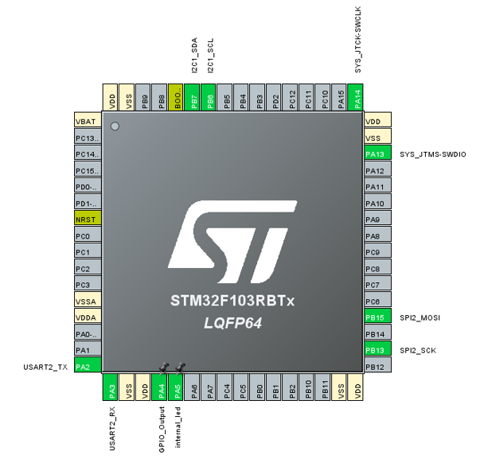
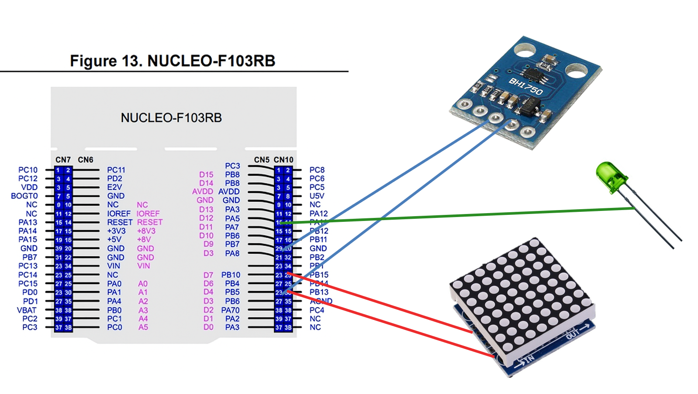
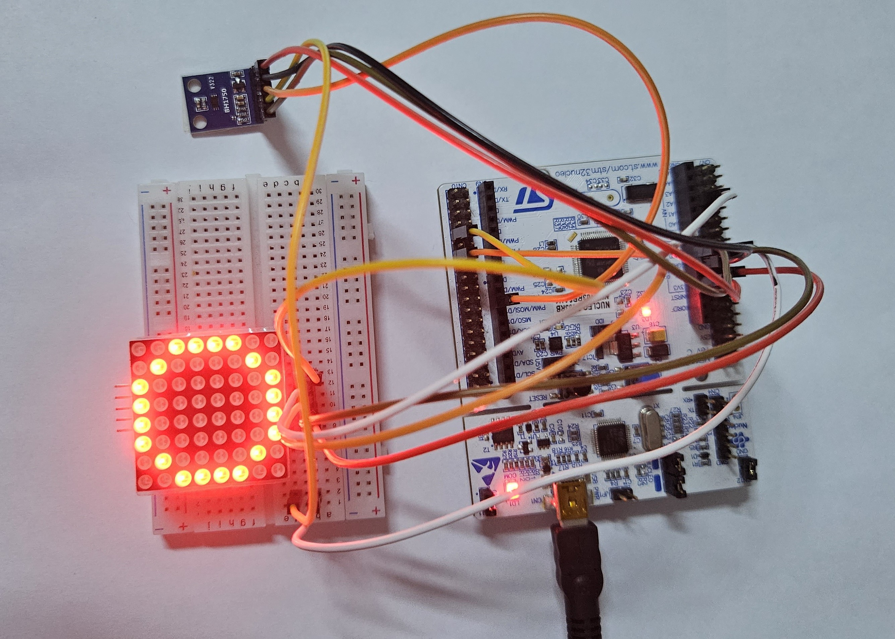
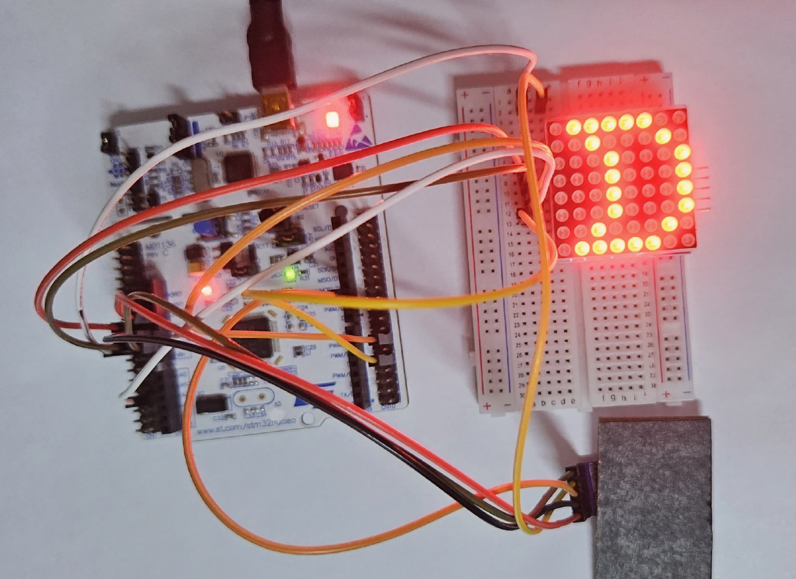

# 조도 기반 조명 제어 시스템

### **통신을 활용한 조도 기반 조명 제어 시스템**
이 프로젝트는 주변 조도를 측정하여 자동으로 조명을 제어하는 시스템입니다. 밝기 센서를 통해 실시간으로 환경을 감지하고, 조명 밝기를 자동으로 조절하도록 설계되었습니다. 통신 기능을 활용해 측정값을 실시간으로 모니터링할 수 있습니다.

- 조도 값에 따라 조명을 자동으로 ON/OFF 제어하는 시스템을 구현, 어두운 환경에서는 조명을 켜고 밝은 환경에서는 자동 소등하여 편의성을 제공
- 조도 센서(BH1750)를 I2C 통신으로 제어하여 주변 밝기를 측정
- 도트 매트릭스(MAX7219)를 SPI 통신으로 제어하여 조도 상태를 시각적으로 표현

### 📸 프로젝트 사진
<!-- STM32 핀 활성화 -->

  
**STM32 핀 활성화**  
STM32CubeMX를 사용하여 I2C, SPI, UART 통신을 위한 핀을 활성화한 화면입니다.

---

<!-- 프로젝트 회로 구조 -->

**STM32 프로젝트 회로 구조**  
프로젝트에서 센서와 모듈 연결을 위해 설계한 회로 구조입니다.

---

<!-- 밝은 곳에서의 조명 제어 -->

**밝은 곳에서의 조명 제어**  
조도 센서를 통해 밝은 환경에서 자동으로 조명이 조절되는 모습입니다.

---

<!-- 어두운 곳에서의 조명 제어 -->

**어두운 곳에서의 조명 제어**  
조도 센서를 통해 어두운 환경에서 조명이 자동으로 켜지는 모습입니다.

